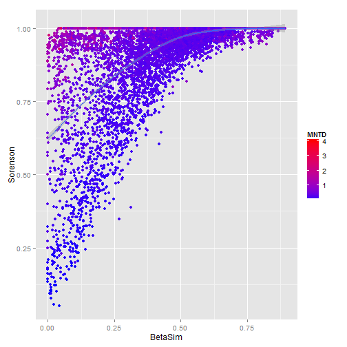

PostCluster Figures
========================================================

We calculated the pairwise betadiversity for all 1 degree land cells on the earth's surface


```r
require(ggplot2)
```

```
## Loading required package: ggplot2
```

```r

require(ggplot2)

droppath <- "C:/Users/Jorge/Dropbox"
```


Here is a nice trick when reading in huge files. First scan the top 5 rows using nrow= in read.table, assign the column classes types and reread the entire data set. This greatly speeds up read in time.


```r
# read in beta file from the cluster
dat5 <- read.table(paste(droppath, "Dimensions/Data/Brazil/beta_out.csv", sep = "/"), 
    nrows = 5)

classes <- sapply(dat5, class)

# don't read the first two columns
classes[c(1, 2)] <- NA
dat <- read.table(paste(droppath, "Dimensions/Data/Brazil/beta_out.csv", sep = "/"), 
    colClasses = classes, row.names = NULL)
```


Plot a small fraction of the pairs

```r
# plot betadiversity against each other
ggplot(dat[sample(1:nrow(dat), 10000), ], aes(y = Sorenson, x = BetaSim, col = MNTD)) + 
    geom_point() + geom_smooth() + scale_color_continuous(low = "blue", high = "red")
```

```
## geom_smooth: method="auto" and size of largest group is >=1000, so using
## gam with formula: y ~ s(x, bs = "cs"). Use 'method = x' to change the
## smoothing method.
```

 


Compute correlations


```r
cor(dat$BetaSim, dat$Sorenson)
```

```
## [1] 0.6076
```

```r
cor(dat$BetaSim, dat$MNTD)
```

```
## [1] -0.1141
```

```r
cor(dat$Sorenson, dat$MNTD)
```

```
## [1] 0.3112
```


