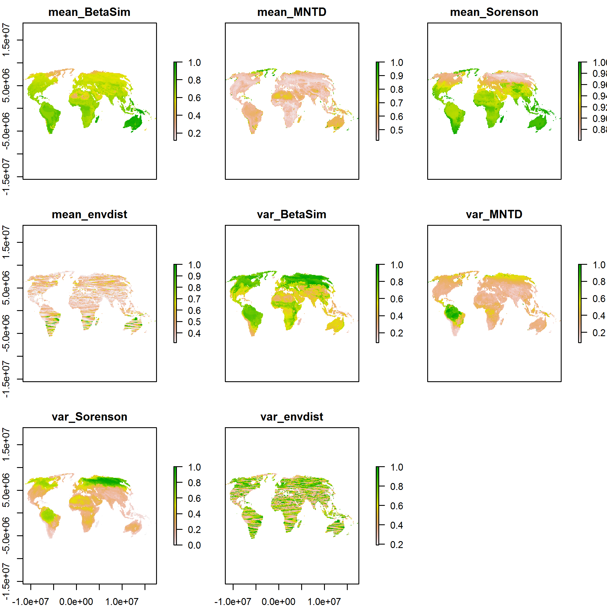

Update on Global Mammal Pairwise Betadiversity Analysis
============================================

**Author**: Ben Weinstein - Stony Brook University

**Date**: 5/19/2014

**Aim**: To update the NSF group on the status of the underlying dataset for further mammal analysis.


**Background**: Similiar underlying data was created in a 2 degree version of this code several months ago by Ben Holt. The goal here was to develop super-computing methods to allow a fuller analysis at (potentially) more biologically meaningful spatial scales. One of the barriers to a finer degree analysis has always been the immense number of pairwise calculations. At 1 degree there were ~12,000 cells on the earth's surface that had terrestrial mammal richness greater than 1. I reduced that 12000 to 10000 unique combinations of species assemblages. I then used parallel computing approaches using the NSF Stampede cluster to compute taxonomic, phylogenetic, trait, environmental and geographic distance betadiversity between all pairwise cells. 

The total analysis took about 3hrs to run across 1000 cores. We should start with the 1 degree analysis to refine the scientific framework moving forward, but i believe a half degree analysis would be feasible. Again, only if it fit our question. 

Below, i walk through the dataset, as well as introduce the **data.table** package, which is critical to handling a input matrix which is 72 million rows. It is not impossible, but needs to be done carefully. I am currently using a relatively new desktop computer with 16gb on ram and either cores to visualize this data. The same result could be achieved on the Wisconsin servers. 

Using data.table to read in raw betadiversity output
----------------------------------------------

The package data.table provides huge opportunities to use sql like syntax to make really efficient queries of large tables.

We will all talk about it more but Gabriel and I initially brainstormed a few metrics
  1. Avg betadiversity for taxonomic, phylogenetic, trait for each cell
  2. Variance in betadiversity for each cell
  3. Quantile of the mean and standard deviation, this would entail:
    * Finding steps 1 and 2
    * Finding the quantile of the mean of each cell to the distribution of means for all cells
    * Same for variance,
    *This would be helpful for deliniating 'high' or 'low' betadiversity quantiles
  4. Compare combinations of betadiversity to env betadiversity
  5. Comparing combinations of betadiversity to distance
  6. Overlaying cells on a biome map and looking at within and between
  
There is alot more you can do with the raw data, which is why i wanted to show the power of the data.table packages

All of this data is available on the github repo https://github.com/bw4sz/BrazilDimDiv .

The final dataset is best held as a .RData object rather than writing to .txt file. It can be loaded using the **load()** function. I have pushed it to the dropbox. Under Dimensions Data/ BetaDistEnv.RData.


```r
# setwd('C:/Users/Jorge/Documents/BrazilDimDiv/cluster')
require(data.table)
require(reshape)
require(raster)
require(rasterVis)

# set knitr options
opts_chunk$set(dpi = 300)

# use fread to read in files, this is much much faster than read.csv
load("C:/Users/sarah/Downloads/BetaDistEnv.RData")
BetaEnvDist
```

```
##           To.OriginalRow From.OriginalRow envdist    km To.xcord To.ycord
##        1:              6                1  1513.4 15943 -1886282  8710048
##        2:              6                2  1497.8 14777 -1886282  8710048
##        3:              6                3  1080.4  5690 -1886282  8710048
##        4:              6                4   899.3     0 -1886282  8710048
##        5:              6                5   408.5  5690 -1886282  8710048
##       ---                                                                
## 72106870:          12243            12247  4035.8  6796 -5486282 -5425952
## 72106871:          12243            12248 14169.4  9211 -5486282 -5425952
## 72106872:          12244            12247  4344.8  8668 -5386282 -5425952
## 72106873:          12244            12248 14471.8  6796 -5386282 -5425952
## 72106874:          12247            12248 10229.9 12276 -5986282 -5549952
##           From.xcord From.ycord BetaSim Sorenson   MNTD
##        1:   -2386282    8710048 0.00000   0.4286 1.9582
##        2:   -2286282    8710048 0.00000   0.4286 1.9582
##        3:   -2186282    8710048 0.00000   0.4286 1.9582
##        4:   -2086282    8710048 0.00000   0.4286 1.9582
##        5:   -1986282    8710048 0.00000   0.4286 1.9582
##       ---                                              
## 72106870:   -5986282   -5549952 0.19241   0.8571 2.1183
## 72106871:   -5886282   -5549952 0.11073   0.7778 2.0219
## 72106872:   -5986282   -5549952 0.19241   0.8519 2.1054
## 72106873:   -5886282   -5549952 0.11073   0.7692 1.9879
## 72106874:   -5886282   -5549952 0.06952   0.2308 0.4267
```


What does the data look like?


```r
head(BetaEnvDist)
```

```
##    To.OriginalRow From.OriginalRow envdist    km To.xcord To.ycord
## 1:              6                1  1513.4 15943 -1886282  8710048
## 2:              6                2  1497.8 14777 -1886282  8710048
## 3:              6                3  1080.4  5690 -1886282  8710048
## 4:              6                4   899.3     0 -1886282  8710048
## 5:              6                5   408.5  5690 -1886282  8710048
## 6:             11                1  3721.2 15943 -1386282  8710048
##    From.xcord From.ycord BetaSim Sorenson  MNTD
## 1:   -2386282    8710048       0   0.4286 1.958
## 2:   -2286282    8710048       0   0.4286 1.958
## 3:   -2186282    8710048       0   0.4286 1.958
## 4:   -2086282    8710048       0   0.4286 1.958
## 5:   -1986282    8710048       0   0.4286 1.958
## 6:   -2386282    8710048       0   0.5000 1.599
```


**OriginalRow** is the row number in the siteXspp matrix made by gabriel. 

When i say To and From, i mean a comparison of cell To to cell From, think of it as a direction.

Cell 'To' is localted at *To.xcord* (x coordinate), *To.ycord* (y coordinate) on the earth's surface, and cell 'From' on *From.xcord* and *From.ycord*. All projections are in the molleweide format, following Carlo's original data. 

The *envdist* is the Euclidean distance of the PCA of the first 19 bioclim variables. 

*Km* is the direct Euclidean distance on the Earth's surface. 

*Betasim* is the phylogenetic betadiveristy, 

*Sorenson* the taxonomic betadiversity, and 

*MNTD* (mean nearest taxon distance) is the trait betadiversity.

**The analysis was performed for all pairwise comparisons of a 1 degree earth where terrestrial mammal richness was greater than 1**

That's a bit better, deleting columns in data.table is the same as setting them to NULL

We can look at the stucture of the **data.table**


```r
str(BetaEnvDist)
```

```
## Classes 'data.table' and 'data.frame':	72106874 obs. of  11 variables:
##  $ To.OriginalRow  : int  6 6 6 6 6 11 11 11 11 11 ...
##  $ From.OriginalRow: int  1 2 3 4 5 1 2 3 4 5 ...
##  $ envdist         : num  1513 1498 1080 899 409 ...
##  $ km              : num  15943 14777 5690 0 5690 ...
##  $ To.xcord        : num  -1886282 -1886282 -1886282 -1886282 -1886282 ...
##  $ To.ycord        : num  8710048 8710048 8710048 8710048 8710048 ...
##  $ From.xcord      : num  -2386282 -2286282 -2186282 -2086282 -1986282 ...
##  $ From.ycord      : num  8710048 8710048 8710048 8710048 8710048 ...
##  $ BetaSim         : num  0 0 0 0 0 0 0 0 0 0 ...
##  $ Sorenson        : num  0.429 0.429 0.429 0.429 0.429 ...
##  $ MNTD            : num  1.96 1.96 1.96 1.96 1.96 ...
##  - attr(*, ".internal.selfref")=<externalptr>
```


Part of the brilliance of **data.table** instead of a **data.frame** is the extremely fast searching and structure. Most of this is achieved through a keyed index. Here i set the combination of the To and From cell number to the key. 

Set key
---

Data.tables have keys which sort the objects

```r
setkey(BetaEnvDist, To.OriginalRow, From.OriginalRow)
```


Susbetting
-------

Data.table subsets tables very very fast. Think of the code inside of the [] as a logical query of the key NOT as a index! This is the important, and difficult to adapt to distinction.


```r
# Subsetting is faster when done directly on the key column
system.time(row1 <- BetaEnvDist[J(1, 361)])
```

```
##    user  system elapsed 
##       0       0       0
```

```r

# Asking the column directly is slightly slower (still fast)
system.time(row1 <- BetaEnvDist[To.OriginalRow %in% 1 & From.OriginalRow %in% 
    361])
```

```
##    user  system elapsed 
##    7.29    1.03    8.33
```

```r

row1
```

```
##    To.OriginalRow From.OriginalRow envdist   km To.xcord To.ycord
## 1:              1              361    3677 5080 -2386282  8710048
##    From.xcord From.ycord BetaSim Sorenson MNTD
## 1:    1113718    7842048  0.4717        1 3.55
```


Check out how fast that was remember BetaEnvDist has `r{dim(BetaEnvDist)}` rows.

Columns as functions
-----
To get both columns was a little tricky, i had to go to stack overflow: http://stackoverflow.com/questions/23521323/r-data-table-for-computing-summary-stats-across-multiple-columns


```r
dat.B <- BetaEnvDist[, list(c(To.OriginalRow, From.OriginalRow), BetaSim, MNTD, 
    Sorenson, envdist, km)]

# it made a column that combined both To and From into a new column V1, not
# sure why it names it V1
setkey(dat.B, V1)

# make a function to compute tests
stat_test <- function(x) {
    c(mean(x[is.finite(x)]), var(x[is.finite(x)]))
}

dat.stat <- dat.B[, c(list(Stat = c("mean", "var")), lapply(.SD, stat_test)), 
    by = V1]

head(dat.stat)
```

```
##    V1 Stat BetaSim  MNTD Sorenson  envdist       km
## 1:  1 mean 0.24611 3.674 0.991580     5655    10004
## 2:  1  var 0.03816 0.299 0.003233 19701574 16841253
## 3:  2 mean 0.24611 3.674 0.991580     5636     9998
## 4:  2  var 0.03816 0.299 0.003233 19670472 17751068
## 5:  3 mean 0.24611 3.674 0.991580     5393    10004
## 6:  3  var 0.03816 0.299 0.003233 18199605 22041605
```

```r

m.stat <- melt(dat.stat, id.var = c("V1", "Stat"))
head(cdat <- cast(m.stat, V1 ~ Stat + variable))
```

```
##   V1 mean_BetaSim mean_MNTD mean_Sorenson mean_envdist mean_km var_BetaSim
## 1  1       0.2461     3.674        0.9916         5655   10004     0.03816
## 2  2       0.2461     3.674        0.9916         5636    9998     0.03816
## 3  3       0.2461     3.674        0.9916         5393   10004     0.03816
## 4  4       0.2461     3.674        0.9916         5250   10004     0.03816
## 5  5       0.2461     3.674        0.9916         5043   10004     0.03816
## 6  6       0.2770     3.221        0.9477         4870   10002     0.04663
##   var_MNTD var_Sorenson var_envdist   var_km
## 1   0.2990     0.003233    19701574 16841253
## 2   0.2990     0.003233    19670472 17751068
## 3   0.2990     0.003233    18199605 22041605
## 4   0.2990     0.003233    16211144 22009830
## 5   0.2990     0.003233    15609620 22041605
## 6   0.4832     0.014296    14657872 21995148
```

```r

# reset to data.table, the above might be slow because we went back to
# data.frame for casting, maybe this could be made better.

cdat <- data.table(cdat)
setkey(cdat, V1)
```


Correlation among means
-----


```r
corall <- cor(cdat[, -1, with = F], use = "complete.obs")
diag(corall) <- NA
corall[upper.tri(corall)] <- NA
round(corall, 2)
```

```
##               mean_BetaSim mean_MNTD mean_Sorenson mean_envdist mean_km
## mean_BetaSim            NA        NA            NA           NA      NA
## mean_MNTD            -0.17        NA            NA           NA      NA
## mean_Sorenson         0.50      0.42            NA           NA      NA
## mean_envdist          0.19      0.01          0.06           NA      NA
## mean_km               0.00      0.01          0.01         0.00      NA
## var_BetaSim          -0.29     -0.30         -0.68         0.02   -0.01
## var_MNTD             -0.06      0.34         -0.09         0.01    0.01
## var_Sorenson         -0.32     -0.30         -0.83         0.01    0.00
## var_envdist           0.02     -0.02         -0.10         0.73   -0.03
## var_km                0.00      0.00         -0.02         0.00   -0.76
##               var_BetaSim var_MNTD var_Sorenson var_envdist var_km
## mean_BetaSim           NA       NA           NA          NA     NA
## mean_MNTD              NA       NA           NA          NA     NA
## mean_Sorenson          NA       NA           NA          NA     NA
## mean_envdist           NA       NA           NA          NA     NA
## mean_km                NA       NA           NA          NA     NA
## var_BetaSim            NA       NA           NA          NA     NA
## var_MNTD             0.29       NA           NA          NA     NA
## var_Sorenson         0.74     0.28           NA          NA     NA
## var_envdist          0.08     0.00         0.12          NA     NA
## var_km               0.02    -0.01         0.01        0.02     NA
```


Okay, you may have noticed we lost the x y coordinates, i've tried this in a couple ways and i find it easier just to remerge the data.table. it will also help to show merging in the new data.table syntax

If you need to index that is NOT a logical statement, but gives the name add a ,with=FALSE to get data.frame like indexing.

Spatial Data
-----


```r
# get spatial info from the beginning table
Todat <- BetaEnvDist[, c("To.OriginalRow", "To.xcord", "To.ycord"), with = F]
Fromdat <- BetaEnvDist[, c("From.OriginalRow", "From.xcord", "From.ycord"), 
    with = F]

# name the same colames, data.table style, call the cell V1 to equal to the
# cdat column name
setnames(Todat, colnames(Todat), c("V1", "X", "Y"))
setnames(Fromdat, colnames(Fromdat), c("V1", "X", "Y"))

# bind data.tables together
spdat <- rbindlist(list(Todat, Fromdat))

# remove duplicates, nice data.table function
spd <- unique(spdat)

setkey(spd, V1)
head(spd)
```

```
##    V1        X       Y
## 1:  1 -2386282 8710048
## 2:  2 -2286282 8710048
## 3:  3 -2186282 8710048
## 4:  4 -2086282 8710048
## 5:  5 -1986282 8710048
## 6:  6 -1886282 8710048
```


Merge
-----

The a[b] syntax is look up rows matching the key of b in the data.table A.

There is also a merge() function that does the exact same thing as with a data.frame. 


```r
# merge is just tomerge[rows]
mergeD <- spd[cdat]
```


Brief data analysis and visualization 
-----------

Just as a first pass i've standardized the data, removed any outliers (quantile > .995), and plotted it spatially. This is not a suggestion for a particular analysis, but a quick way to understand the remaining steps in data validation and overall patterns.


```r
# i think we need a data.frame here, just give it the x y coords and column
# you want to be the values lets make it a function to repeat across all
# columns
makeMap <- function(colnam) {
    df <- data.frame(mergeD[, c("X", "Y", colnam), with = F])
    
    # create spatial points data frame
    spg <- df
    coordinates(spg) <- ~X + Y
    
    # coerce to SpatialPixelsDataFrame
    
    gridded(spg) <- TRUE
    # coerce to raster
    rasterDF <- raster(spg)
    
    # divide by the 99th quantile and set to 99th quantile
    stand <- quantile(rasterDF, 0.995)
    
    rasterDF[rasterDF > stand] <- stand
    
    return(rasterDF/stand)
}

allMaps <- stack(lapply(colnames(mergeD)[!colnames(mergeD) %in% c("V1", "X", 
    "Y", "mean_km", "var_km")], makeMap))

plot(allMaps)
```

 


**Remember that there are no apriori spatial outlines in this raster. The plot demonstrates that the code successfully computes betadiversity values in a reasonable manner, since it correctly recreates the shapes of the continents, and the values are relatively smooth across space. This is a very good check on the inner workings of the parallelize code. 

Next steps
------

1. My first inclination is to look at where phylogenetic and trait betadiversity are disconnected. That is where you see 'high' phylo, 'low' trait, or the reverse. I associate high phylogenetic, low trait betadiversity with convergent evolution. We should therefore see these kinds of patterns at *large distance* in similiar environments. The reverse would be low phylo, high trait, which is associated with adaptive radiation. These should be at short distances and dissimiliar environments.

2. Instead of directly plotting the betadiversity values, the idea would be to take the quantiles of these means and then project those into space simulataneously, using the code similiar to ana's risk/climate velocity map so show where taxonomic/phylogenetic/trait are all high/low in a mapped product. Gabriel has that code.

I can show this for the mean data, but the real analysis should be done on the cell by cell comparison of the original data.


```r
cutmaps <- stack(lapply(1:nlayers(allMaps), function(x) {
    
    # cut raster to pieces
    cutmap <- cut(allMaps[[x]], quantile(allMaps[[x]], c(0, 0.05, 0.95, 1), 
        right = TRUE))
    
    # make an attribute table
    cutmap <- ratify(cutmap)
    rat <- levels(cutmap)[[1]]
    # name the levels
    rat$legend <- c("Low", "Med", "High")
    levels(cutmap) <- rat
    return(cutmap)
}))

# name

names(cutmaps) <- names(allMaps)
# set theme
myTheme = rasterTheme(region = brewer.pal("RdBu", n = 3))

levelplot(cutmaps, par.settings = myTheme)
```

 


Again, i want to stress that this analysis makes much more sense on the cell by cell table (BetaDistEnv) than on the aggregate mean, but it helps show my point. 

3. Another approach would be to compute neighborhood cell statistics. In this case, it doesn't matter what the global betadiversity is (eg. mean environment), but how rapid that betadiversity changes over space. This approach would create more intuitive for the env betadiversity. Right now, the 'area' of the biome conflates with how 'endemic' each cell's env is. 


There are a myriad of approaches. My hope was to create a foundation dataset with which others could subset or use for subsequent analysis.

Thanks!

Ben


